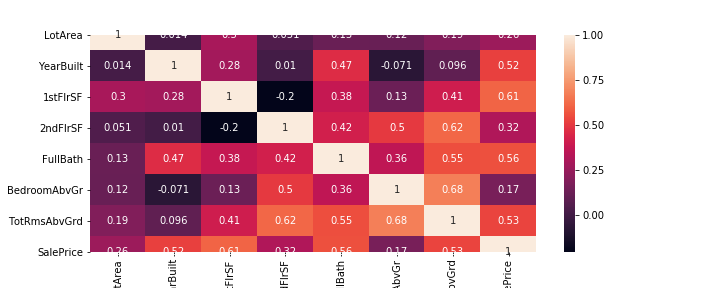
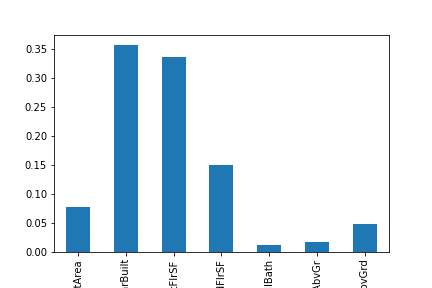

# Ames-Housing-dataset-Price-Prediction

Data Set used for Training the Model:
  "data/train.csv"
  
Features = ['LotArea', 'YearBuilt', 'FlrSF1st', 'FlrSF2nd', 'FullBath', 'BedroomAbvGr', 'TotRmsAbvGrd']

Target = ['SalePrice']

#### Feature Description
LotArea: Lot size in square feet  
YearBuilt:  Original construction date  
FlrSF1st: First Floor square feet  
FlrSF2nd: Second floor square feet  
FullBath: Full bathrooms above grade  
BedroomAbvGr: Bedrooms above grade (does NOT include basement bedrooms)  
TotRmsAbvGrd: Total rooms above grade (does not include bathrooms)  

### Correlation Heatmap

### Feature Importances
   The Higher the bar is show the highly correlated the value is: 
   

#### Tools/ Language/ Scripting

